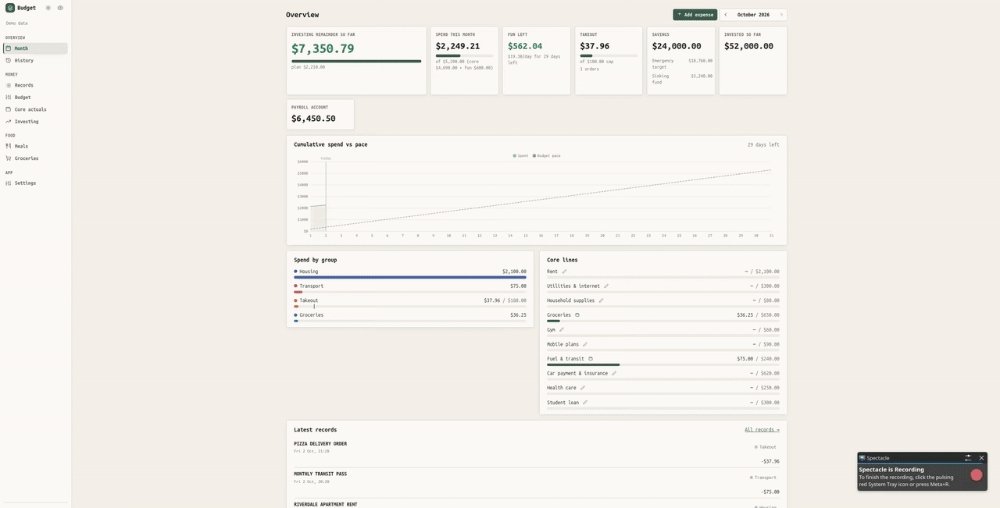

# Budget tracker

Single-user web app that pulls transactions from the Wallet (BudgetBakers) API or an export file, removes duplicates, classifies them and shows each month against a fixed-amount budget. It also holds a meal plan, a grocery list and an investing projection. Stack: Node.js, TypeScript, Express, SQLite, Angular. See `docs/SPEC.md`.

## Setup

```
pnpm install
cp config/seed-config.example.json config/seed-config.json
```

Create `.env` with `WALLET_API_TOKEN=<your token>`. Edit `config/seed-config.json`; it seeds the database on first run.

## Personalise

Copy `config/seed-config.example.json` to `config/seed-config.json` and edit it. The database is seeded from this file only on first run; afterwards change settings on the Budget screen, or delete `data/budget.db` to reseed (this also deletes imported records and typed actuals).

- `wallet.groups`: the spending groups shown in the app. `Other` collects what nothing else matches.
- `wallet.categoryMap`: Wallet category name to group. A category with no entry falls back to its Wallet parent category's entry, then to `Other`. API categories are stored under the names the export uses.
- `wallet.merchantKeywords`: case-insensitive substring of the record note to group. A keyword wins over the category map; the first match in list order wins, so put specific keywords first.
- `wallet.excludedGroups`: groups that are not spending (transfers, investing) and are left out of spend totals. A keyword for such a group also wins over `Income`.
- `allocation.funGroups`: groups that count against the monthly fun budget. Other groups without a core line count as unplanned spending.
- `coreExpenses`: fixed monthly lines. `source` is `manual` (typed each month) or `wallet:Group` / `wallet:Group+Group` (summed from those groups). Typed values are added on top of Wallet-fed ones.

Keep personal acceptance checks in `*.local.test.ts` and personal notes in `CLAUDE.local.md` and `docs/SPEC.local.md`; all are git-ignored.

Settings holds database currency, theme and hidden amounts. Normal databases default to EUR; demo uses USD. Choose EUR or USD before storing records, accounts or core actuals, which lock currency. Amounts are never converted; existing EUR history stays EUR. Wallet sync, writes and imports support EUR only. Theme and privacy apply immediately and persist in this browser.

## Commands

- `pnpm dev` runs the server and the web app together.
- `pnpm sync` pulls Wallet records, then dedupes and classifies. It mirrors edits and deletions (deletes reconciled over the last 90 days); `pnpm sync -- --full` reconciles all history.
- The server (not demo) fetches from Wallet at startup when the last sync is over an hour old, then hourly; it shares one in-flight sync with the manual Fetch. Each sync stores today's account balances in `balance_snapshots` (history starts at first sync).
- Daily backup: at startup and daily the server writes `data/backups/budget-YYYY-MM-DD.db` (`VACUUM INTO`) and keeps the newest 14. Restore: stop the server, copy a backup over `data/budget.db`.
- Add record has an "Also add to Wallet" switch that creates the record in Wallet after a preview. Records created that way can later be deleted in Wallet from Records (confirm); no other Wallet record is ever deleted.
- `pnpm run import <file.xls>` runs the same pipeline from a Wallet export.
- `pnpm test`, `pnpm lint`

## Demo

`pnpm demo` needs no `.env` or Wallet token. It regenerates and runs `data/demo.db`, isolated from `data/budget.db`; sync and "Also add to Wallet" are disabled. It starts at ports 3001 (API) and 4201 (web), choosing the next available localhost port when needed; `pnpm dev` remains unchanged.

The generic dataset covers the latest 18 months relative to the run date and includes duplicates and unclassified records. `pnpm demo:seed` resets it, discarding demo edits and manual records.

### Feature showcase



## Data

The server listens on localhost only. The database, exports, `.env` and personal config stay on your machine and are git-ignored.

## Credits

Built with Claude Code (Anthropic).

Not affiliated with or endorsed by BudgetBakers. "Wallet" and its logo are trademarks of BudgetBakers; this project reads data through their public API and creates a record only when you turn on "Also add to Wallet".
